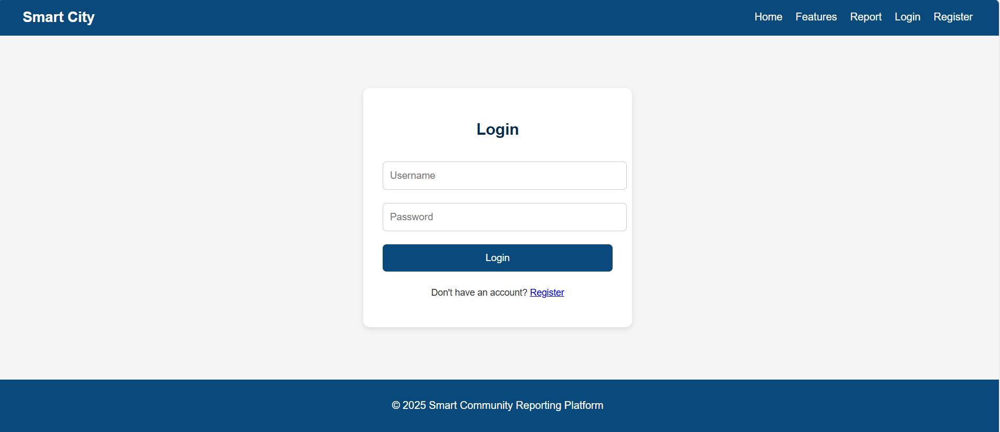
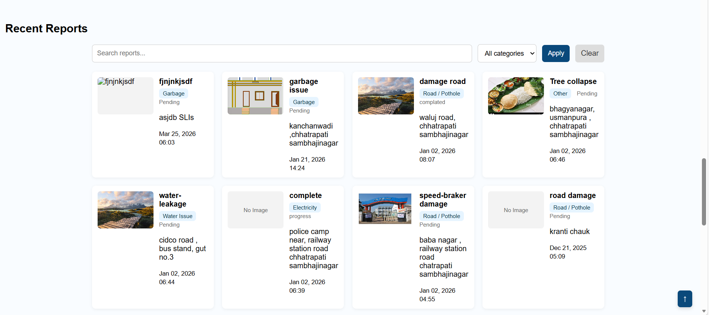

\# 🌆 Smart City Project


\## 📌 Description

Smart City is a Django-based web application where citizens can report issues (like roads, garbage, etc.) and admin can manage them.


\---


\## 🚀 Features

\- 👤 User Registration \& Login

\- 📝 Complaint Submission

\- 🖼️ Image Upload (issue proof)

\- 🛠️ Admin Dashboard

\- 📊 Issue Management System


\---


\## 🛠️ Tech Stack

\- Backend: Django (Python)

\- Frontend: HTML, CSS, JavaScript

\- Database: SQLite


\---


\## ⚙️ Installation (Run Locally)


```bash

git clone https://github.com/ONKARAMBHORE/Smart-City.git

cd Smart-City

pip install -r requirements.txt

python manage.py runserver


📷 Screenshots


Home Page

(screenshots/home1.png)
(screenshots/home3.png)

Login Page


Recent Report



📌 Future Improvements

Live location tracking

Email notifications

Mobile responsive UI

👨‍💻 Author

Onkar Ambhore


